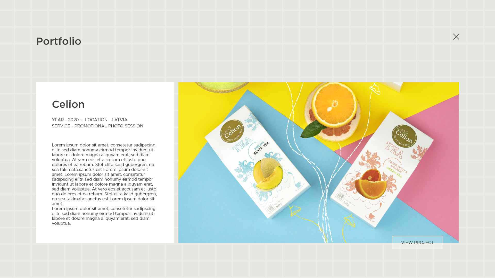

import Spacing from "../components/MDX/Spacing"
import PSpacing from "../components/MDX/PSpacing"
import Grid2 from "../components/MDX/Grid2"
import Grid4 from "../components/MDX/Grid4"
import Summary from "../components/MDX/Summary"
import Item from "../components/MDX/Item"
import PreFooter from "../components/MDX/PreFooter"

import Social from "../components/MDX/Social"
import { FaBehance } from "@react-icons/all-files/fa/FaBehance"

import FlexGrid4 from "../components/MDX/FlexGrid4"
import FlexItem from "../components/MDX/FlexItem"
import FlexColumn from "../components/MDX/FlexColumn"

import FlexGallery from "../components/MDX/FlexGallery"

import PSpacing2 from "../components/MDX/PSpacing2"

## Summary

<Grid2>

In 2020, in the span of 2 months I interned at a Latvian brand sales and marketing agency Bsms.

I participated in group projects that included the following activities: web design, graphic design, videography, marketing and planning.

</Grid2>

<PSpacing>

## B-studio Web Design - Portfolio Projects Page Variations

<PSpacing2>

One of my group projects involved creating web page and section designs for the B-studio website.

</PSpacing2>

</PSpacing>

<Item>

</Item>

<Spacing />

<Grid2>

<Item>

</Item>

<Item>

</Item>

</Grid2>

<PSpacing>

## Portfolio Project Page Variations

</PSpacing>

<Item>

</Item>

<Spacing />

<Item>

</Item>

<PSpacing>

## Blog Page Variations

</PSpacing>

<Grid2>

<Item>

</Item>

<Item>

</Item>

<Item>

</Item>

<Item>

</Item>

</Grid2>

<PSpacing>

## Video Production Page Variations

</PSpacing>

<Grid2>

<Item>

</Item>

<Item>

</Item>

</Grid2>

<PSpacing>

## Video Production Section

</PSpacing>

<Grid2>

<Item>

</Item>

<Item>

</Item>

</Grid2>

<PSpacing>

## Promotional Photo Sessions Page

</PSpacing>

<Item>

</Item>

<PSpacing>

## Styling and Design Section

</PSpacing>

<Grid2>

<Item>

</Item>

<Item>

</Item>

</Grid2>

<PSpacing>

## Events Section

</PSpacing>

<Item>

</Item>

<PSpacing>

## Instagram Feed Section

</PSpacing>

<Item>

</Item>

<Spacing />

<Item>

</Item>

<PSpacing>

## BePersonal B2B Email Blast Message

<PSpacing2>

Another task I was given was to design a B2B email blast message for the BePersonal brand that designs personalized cards.

</PSpacing2>

</PSpacing>

<Grid2>

<Item>

</Item>

<Item>

</Item>

</Grid2>

<PSpacing>

## Animated Grid Background

<PSpacing2>

During the internship, I had an idea I wanted to realize just for the fun of it - this is that idea. It's an animated grid background that reacts on mousemove. The idea is that when you move your mouse over to the background instead of the divisions with content, the background would move, making the website just a little more interactive and fun.

</PSpacing2>

</PSpacing>

<Item>

<iframe
  height="300"
  style="width: 100%;"
  scrolling="no"
  title="Parallax grid background"
  src="https://codepen.io/c4pslock/embed/mdPqPMW?default-tab=html%2Cresult"
  frameborder="no"
  loading="lazy"
  allowtransparency="true"
  allowfullscreen="true"
>
  See the Pen{" "}
  <a href="https://codepen.io/c4pslock/pen/mdPqPMW">Parallax grid background</a>{" "}
  by Anna (<a href="https://codepen.io/c4pslock">@c4pslock</a>) on{" "}
  <a href="https://codepen.io">CodePen</a>.
</iframe>

</Item>

<PreFooter />
