import Spacing from "../components/MDX/Spacing"
import PSpacing from "../components/MDX/PSpacing"
import Grid2 from "../components/MDX/Grid2"
import Grid4 from "../components/MDX/Grid4"
import Summary from "../components/MDX/Summary"
import Item from "../components/MDX/Item"
import PreFooter from "../components/MDX/PreFooter"

import Social from "../components/MDX/Social"
import { FaBehance } from "@react-icons/all-files/fa/FaBehance"
import { FaDribbble } from "@react-icons/all-files/fa/FaDribbble"
import { FaInstagram } from "@react-icons/all-files/fa/FaInstagram"

## Summary

<Grid2>

[DailyUI](https://www.dailyui.co/) is a challenge that provides daily design prompts for UI designers to practice and become better designers.

For about a week, I participated in the challenge and used their exercises to practice UI design and create creative design solutions.

</Grid2>

<Social>

<a href="https://www.behance.net/gallery/144026303/DailyUI-%28001-009%29" className="social-icon">

<FaBehance />

View on Behance

</a>

</Social>

<Social>

<a href="https://dribbble.com/shots/16765960-Daily-UI-009-Music-Player" className="social-icon">

<FaDribbble />

View on Dribbble

</a>

</Social>

<Social>

<a href="https://www.instagram.com/p/CV0SXCpqnlb/" className="social-icon">

<FaInstagram />

View on Instagram

</a>

</Social>

<PSpacing>

## 001 - Tour booking app

</PSpacing>

<Item>

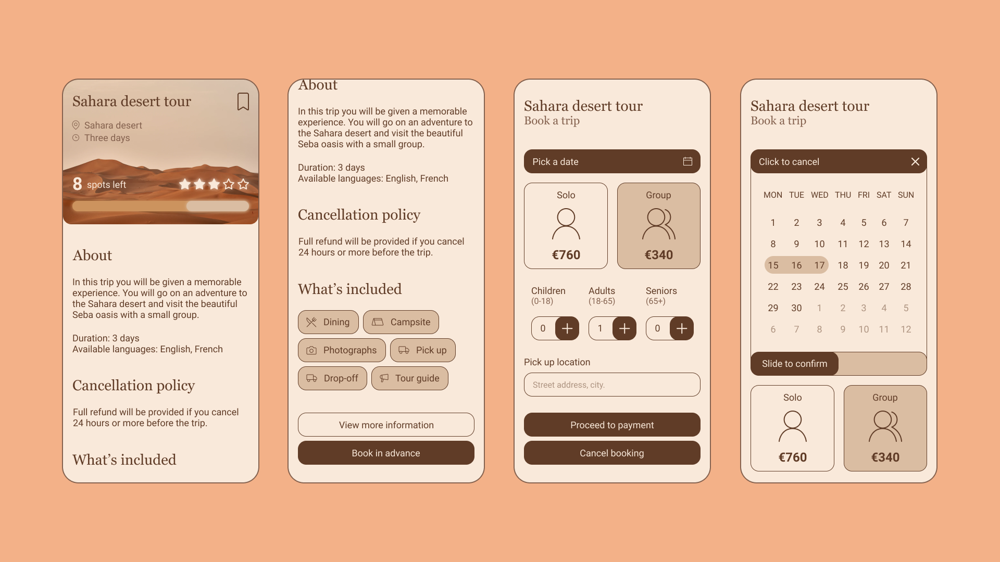

</Item>

<PSpacing>

## 002 - Credit card checkout

</PSpacing>

<Grid2>

<Item>

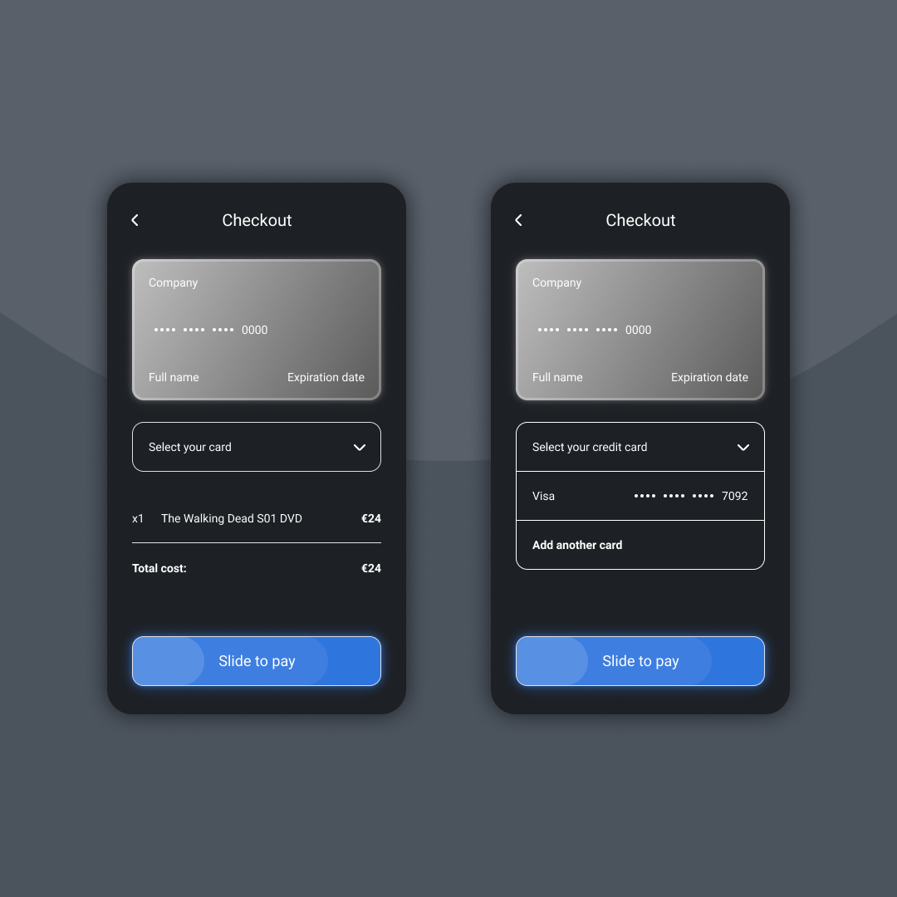

</Item>

<Item>

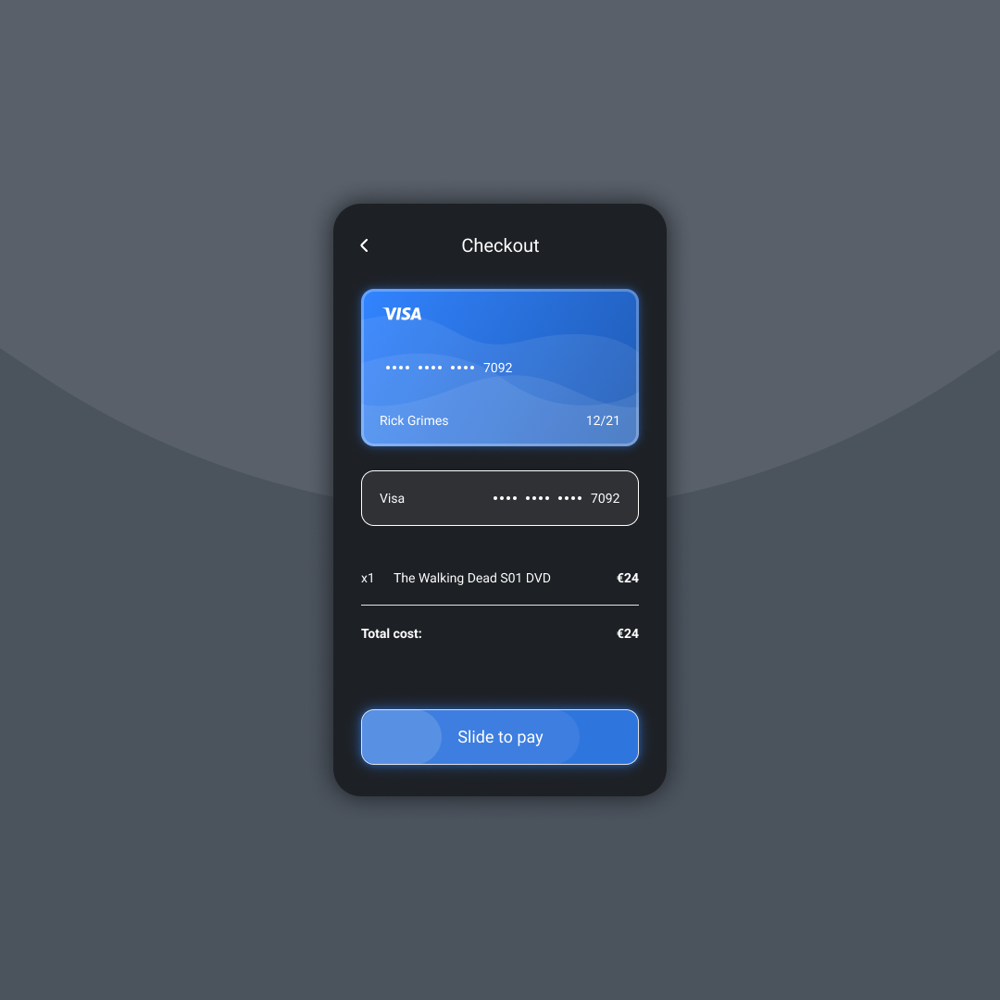

</Item>

<Item>

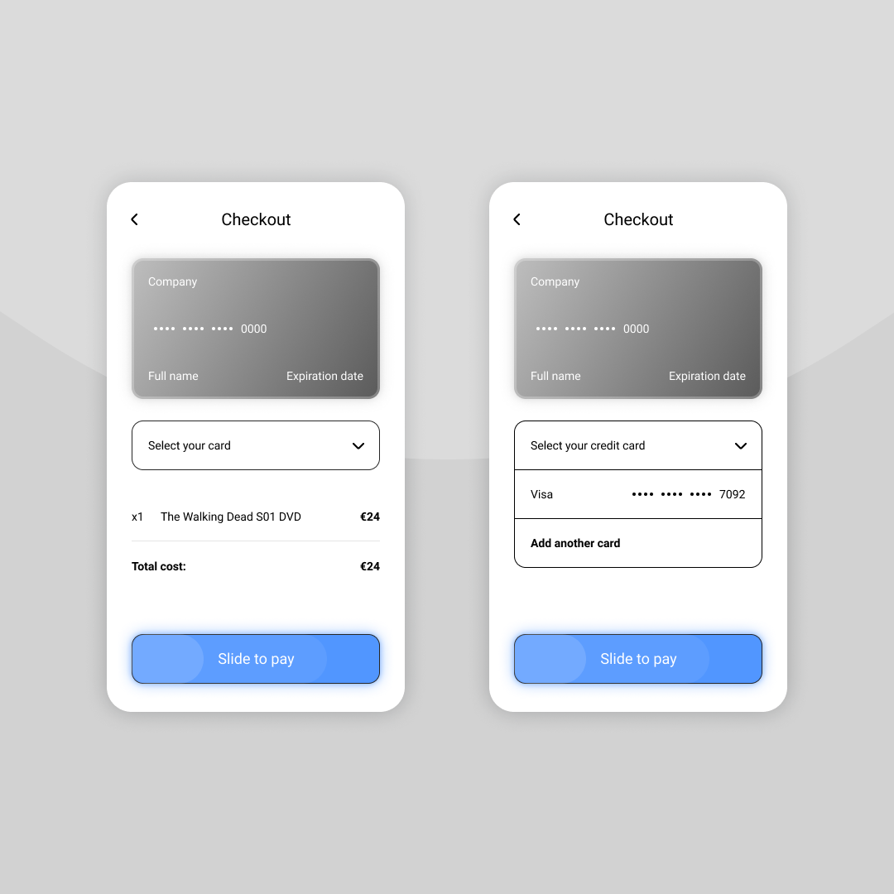

</Item>

<Item>

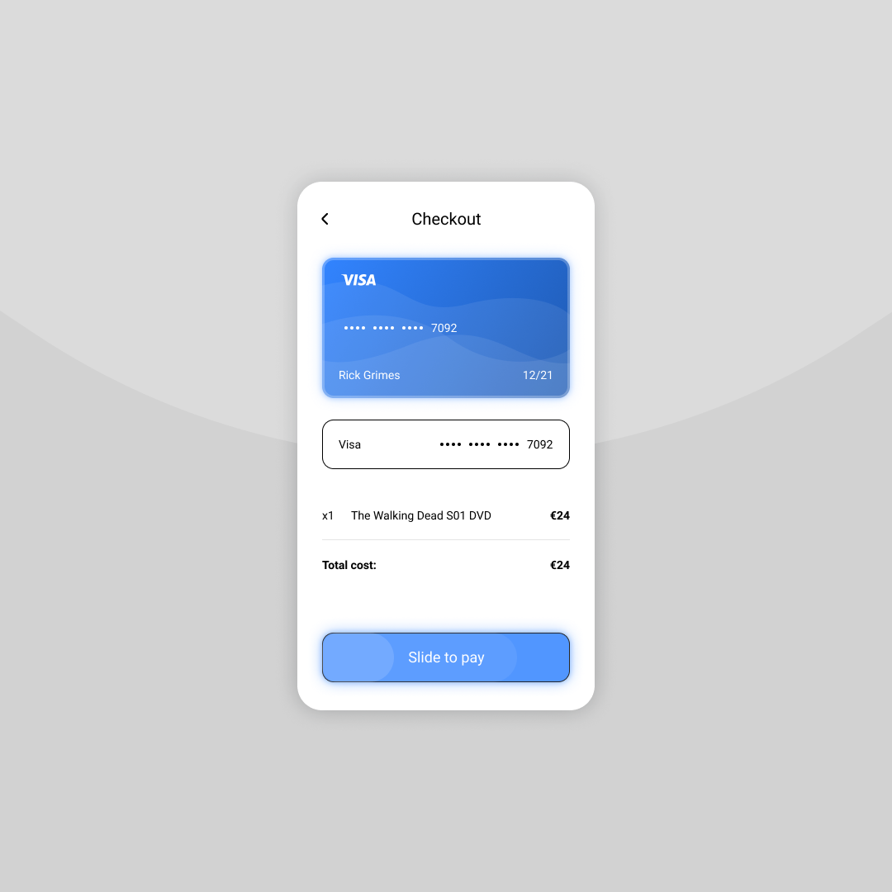

</Item>

</Grid2>

<PSpacing>

## 003 - Landing page

</PSpacing>

<Item>

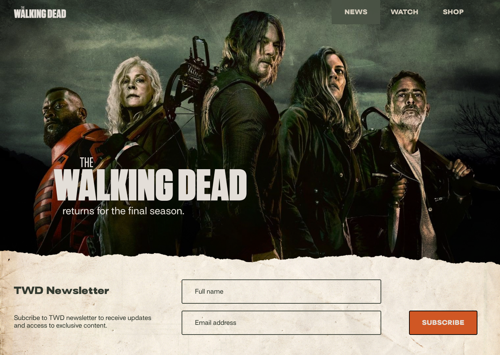

</Item>

<PSpacing>

## 004 - Calculator app

</PSpacing>

<Item>

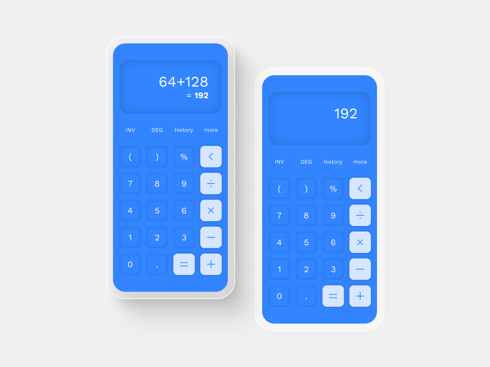

</Item>

<PSpacing>

## 005 - App icon

</PSpacing>

<Item>

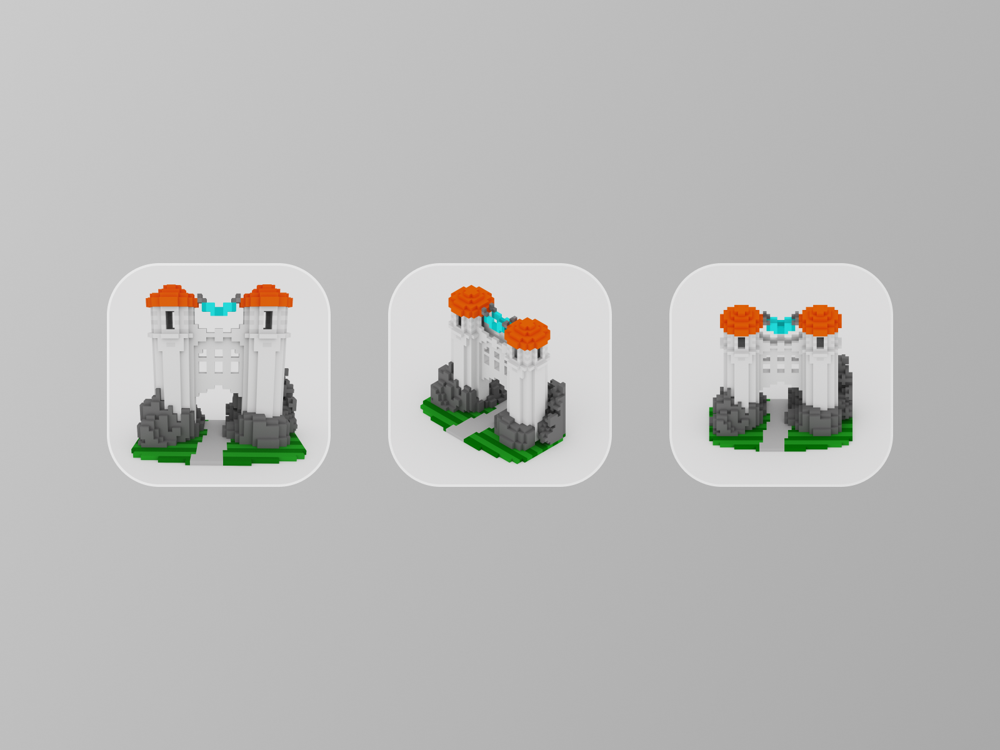

</Item>

<PSpacing>

## 006 - User profile

</PSpacing>

<Item>

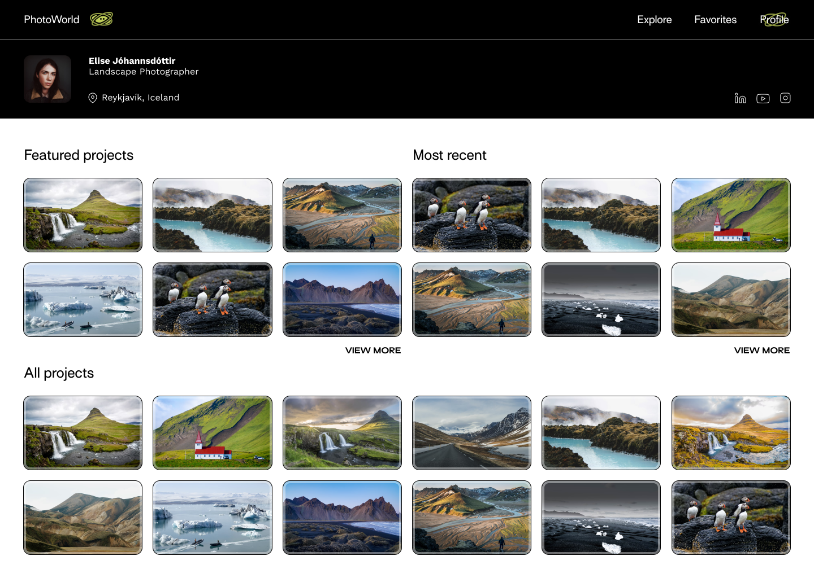

</Item>

<PSpacing>

## 007 - Settings

</PSpacing>

<Item>

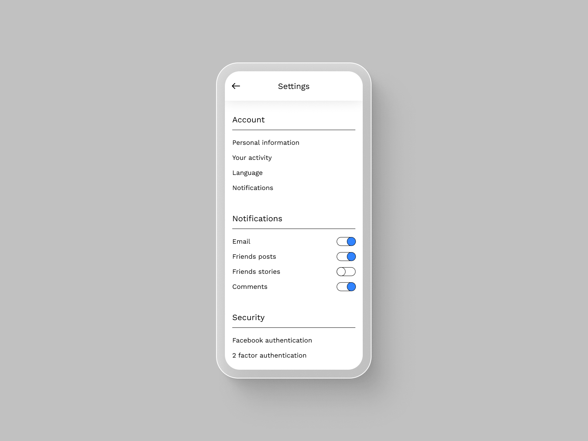

</Item>

<PSpacing>

## 008 - 404 page

</PSpacing>

<Item>

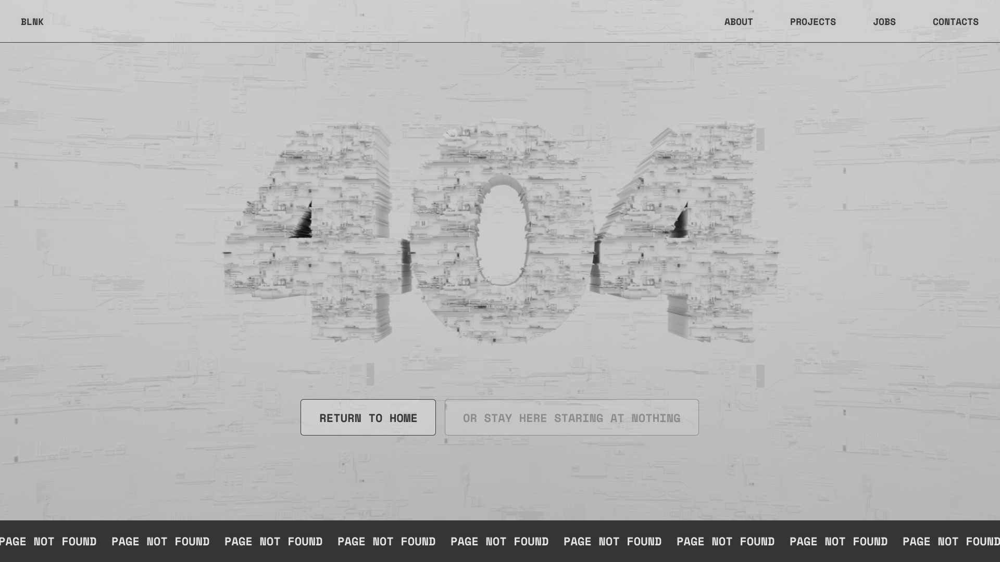

</Item>

<PSpacing>

## 009 - Music player

</PSpacing>

<Item>

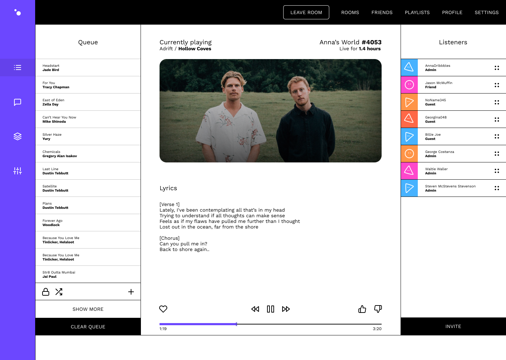

</Item>

<PreFooter />
