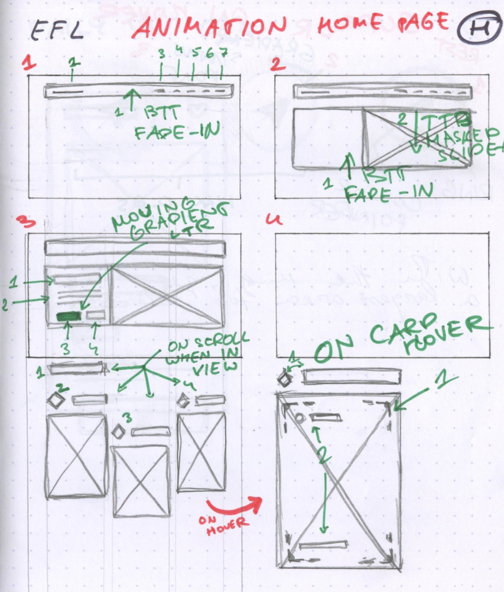
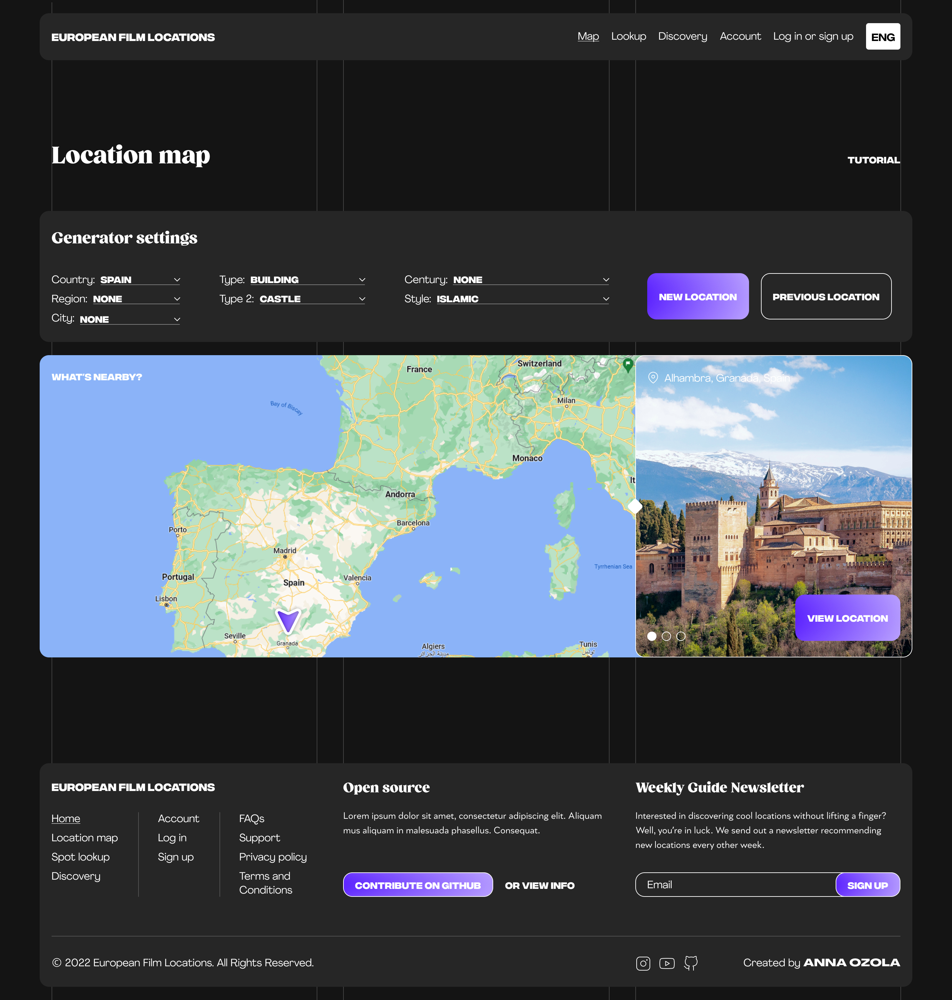

import Spacing from "../components/MDX/Spacing"
import PSpacing from "../components/MDX/PSpacing"
import PSpacing2 from "../components/MDX/PSpacing2"
import Grid2 from "../components/MDX/Grid2"
import Grid4 from "../components/MDX/Grid4"
import Summary from "../components/MDX/Summary"
import Item from "../components/MDX/Item"
import PreFooter from "../components/MDX/PreFooter"

import FlexColumn from "../components/MDX/FlexColumn"
import FlexColumn2 from "../components/MDX/FlexColumn2"
import FlexItem from "../components/MDX/FlexItem"
import FlexItem2 from "../components/MDX/FlexItem2"
import FlexGallery from "../components/MDX/FlexGallery"
import FlexGallery2 from "../components/MDX/FlexGallery2"

import Social from "../components/MDX/Social"
import { FaBehance } from "@react-icons/all-files/fa/FaBehance"
import { FaInstagram } from "@react-icons/all-files/fa/FaInstagram"
import { FaDribbble } from "@react-icons/all-files/fa/FaDribbble"

import React from "react"
import ReactPlayer from "react-player"
import Video from "../components/MDX/Video"
import VideoWeb from "../components/MDX/VideoWeb"
import Video2048 from "../components/MDX/Video2048"

## Summary

European Film Locations is a website that showcases film locations in Europe. The EFL design was created as a practice project based on a website idea I've had on my mind for a while. I used this project idea to experiment with eye-catching styles.

<Social>

<a href="https://www.behance.net/gallery/155604059/European-Film-Locations" className="social-icon">

<FaBehance />

View on Behance

</a>

</Social>

<Social>

<a href="https://dribbble.com/shots/21322142-European-Film-Locations" className="social-icon">

<FaDribbble />

View on Dribbble

</a>

</Social>

<Social>

<a href="https://www.instagram.com/p/CkI5FNRspNa/" className="social-icon">

<FaInstagram />

View on Instagram

</a>

</Social>

<PSpacing>

## Desktop version UI animation

<Grid2>

<PSpacing2>

The animation was created in Adobe After Effects, with the help of Figma and AEUX to transfer the design layers from Figma to After Effects.

</PSpacing2>

<PSpacing2>

Want to know my process? Here's how I think.

Abbreviation reference: BTT - bottom to top, TTB - top to bottom, LTR - left to right.

</PSpacing2>

</Grid2>

</PSpacing>

<Grid2>

<Item>

<FlexGallery2>

<VideoWeb>

<ReactPlayer
  className="react-player"
  width="100%"
  height="100%"
  controls={true}
  loop={true}
  playing={true}
  url="https://vimeo.com/822083951"
/>

</VideoWeb>

</FlexGallery2>

</Item>

<Item>

<FlexItem2>

</FlexItem2>

</Item>

</Grid2>

<PSpacing>

## Desktop version

</PSpacing>

<Item>

</Item>

<PSpacing>

Find the perfect filming locations by using the location map generator setting filters.

</PSpacing>

<Item>

</Item>

<PSpacing>

View specific information about the location such as truck access or dining. Share the location or save it to your account. Read about the history of the location. Filter through similar locations.

</PSpacing>

<Item>

</Item>

<PreFooter />
