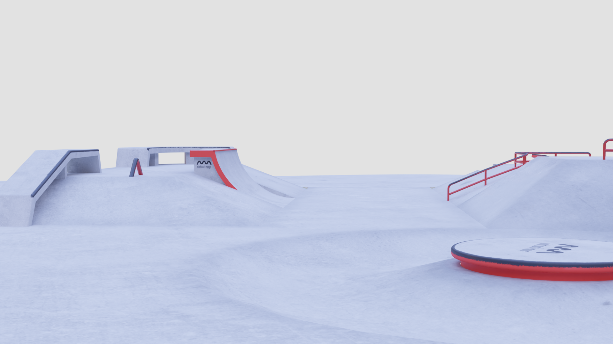
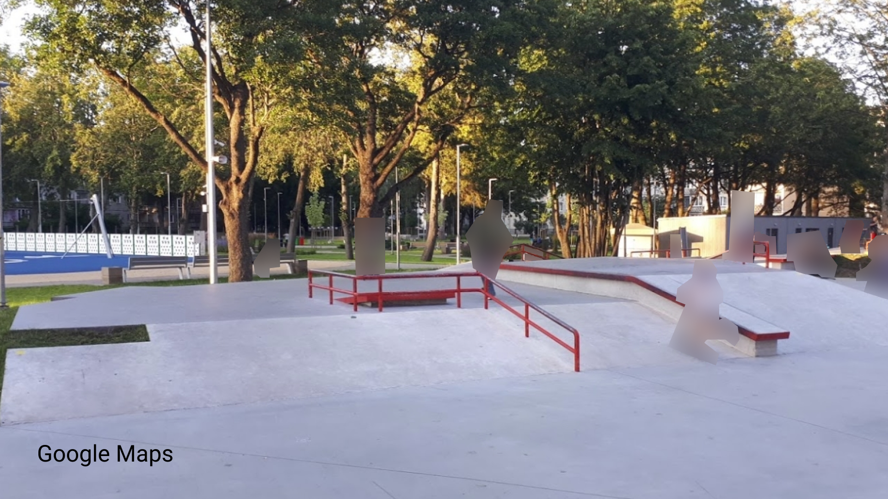

import Spacing from "../components/MDX/Spacing"
import PSpacing from "../components/MDX/PSpacing"
import Grid2 from "../components/MDX/Grid2"
import Grid4 from "../components/MDX/Grid4"
import Summary from "../components/MDX/Summary"
import Item from "../components/MDX/Item"

import Social from "../components/MDX/Social"
import { FaArtstation } from "@react-icons/all-files/fa/FaArtstation"
import { FaInstagram } from "@react-icons/all-files/fa/FaInstagram"

## Summary

<Grid2>

About 3 months ago I recreated my local skatepark in 3D. This was my first time-consuming 3D project. In total I spent around 100h on it because of the learning process.

The real-life park is located in Imanta, Riga, Latvia. It's made by a skatepark construction company - Mindworkramps. They have built the best, most beautiful skateparks and pump tracks in Latvia and other Baltic countries.

This park is available to play in SkaterXL here: https://skaterxl.mod.io/imanta-skatepark

</Grid2>

<Social>

<a href="https://www.artstation.com/artwork/rAaq36" className="social-icon">

<FaArtstation />

View on Artstation

</a>

</Social>

<Social>

<a href="https://www.instagram.com/p/CUKmKg0qsVc/" className="social-icon">

<FaInstagram />

View on Instagram

</a>

</Social>

<PSpacing>

## Renders

</PSpacing>

<Grid2>

<Item>

</Item>

<Item>

</Item>

<Item>

</Item>

<Item>

</Item>

<Item>

</Item>

<Item>

</Item>

</Grid2>

<PSpacing>

## Wireframe renders

</PSpacing>

<Grid2>

<Item>

</Item>

<Item>

</Item>

<Item>

</Item>

<Item>

</Item>

</Grid2>

<Spacing />

<Item>

</Item>

<PSpacing>

## Reference images

</PSpacing>

<Item>

</Item>

<Spacing />

<Grid2>

<Item>

</Item>

<Item>

</Item>

<Item>

</Item>

<Item>

</Item>

</Grid2>
