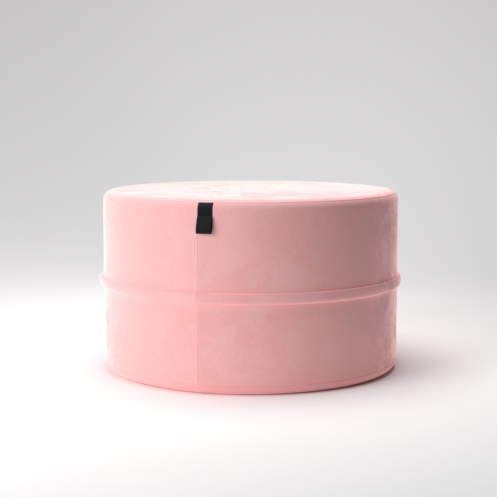
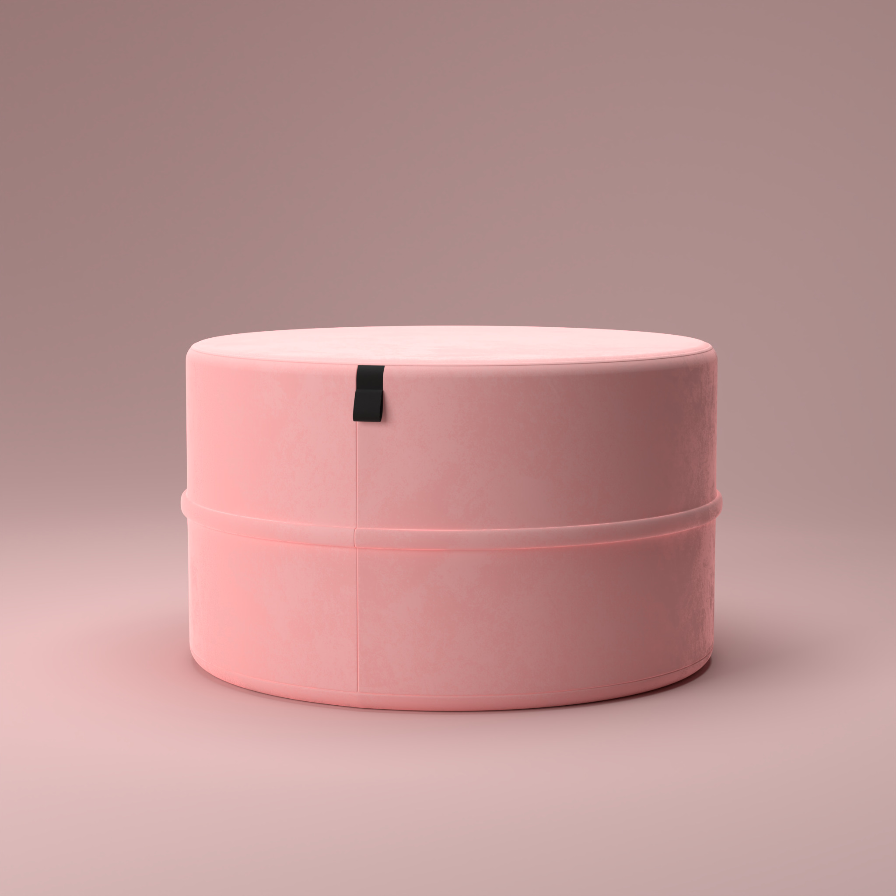
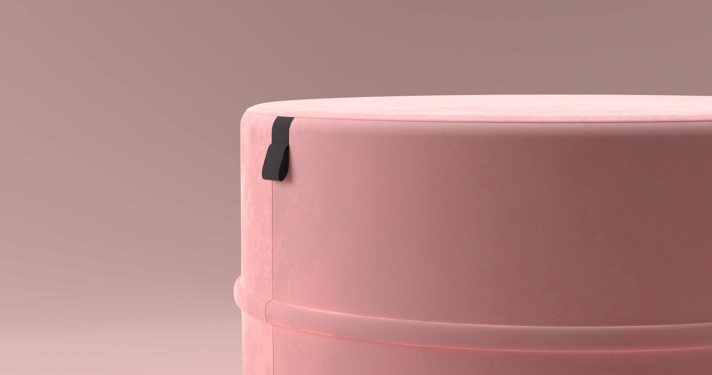

import Spacing from "../components/MDX/Spacing"
import PSpacing from "../components/MDX/PSpacing"
import Grid2 from "../components/MDX/Grid2"
import Grid4 from "../components/MDX/Grid4"
import Summary from "../components/MDX/Summary"
import Item from "../components/MDX/Item"
import PreFooter from "../components/MDX/PreFooter"

import Social from "../components/MDX/Social"
import { FaInstagram } from "@react-icons/all-files/fa/FaInstagram"

## Summary

<Grid2>

This project was created to practice product visualization. I recreated [POP Pouf 60 made by Oot Oot studios](https://oot-oot.com/product/pouf-pop-60-2/?v=a7bdee32cb21).

The project was entirely created using the open source software Blender. Materials were created proceduraly using Blender's node based shader editor. Images were rendered using Cycles.

</Grid2>

<Social>

<a href="https://www.instagram.com/p/Cbr8dhXqFYP/" className="social-icon">

<FaInstagram />

View on Instagram

</a>

</Social>

<Grid2>

<Item>

</Item>

<Item>

</Item>

</Grid2>

<Spacing />

<Item>

</Item>

<PreFooter />
