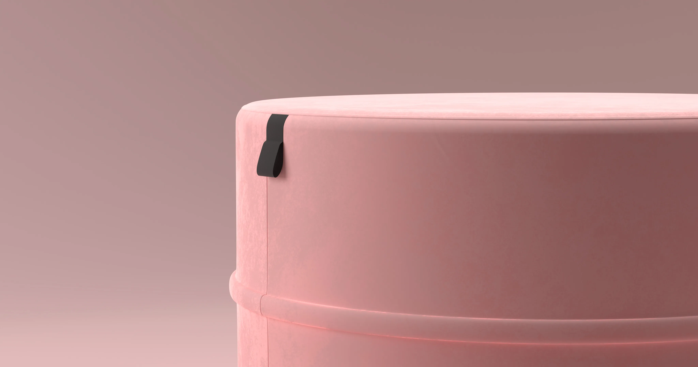

## Origins

This project was created to practice product visualization. I recreated [POP Pouf 60 made by Oot Oot studios](https://oot-oot.com/product/pouf-pop-60-2/?v=a7bdee32cb21).

## Another color.

The project was 100% made using Blender.

## Webp test

