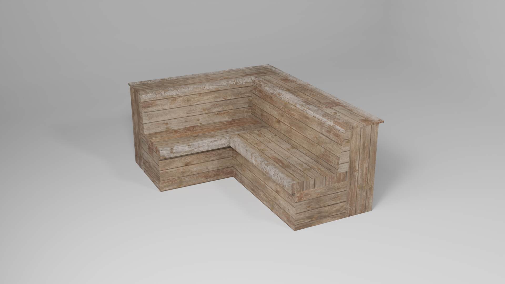
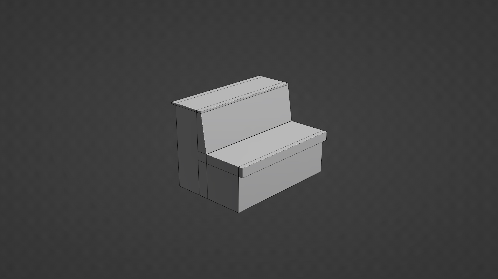

import Spacing from "../components/MDX/Spacing"
import PSpacing from "../components/MDX/PSpacing"
import PSpacing2 from "../components/MDX/PSpacing2"
import Grid2 from "../components/MDX/Grid2"
import Grid4 from "../components/MDX/Grid4"
import Summary from "../components/MDX/Summary"
import Item from "../components/MDX/Item"
import PreFooter from "../components/MDX/PreFooter"

import Social from "../components/MDX/Social"
import { FaArtstation } from "@react-icons/all-files/fa/FaArtstation"
import { FaInstagram } from "@react-icons/all-files/fa/FaInstagram"

import React from "react"
import ReactPlayer from "react-player"
import Video from "../components/MDX/Video"

## Summary

<Grid2>

Winterland is an unreleased fan-made SkaterXL level that I created as a Unity level design and modeling practice project.

In this project, I utilized my knowledge of design to create poster, sticker and logo designs using Figma and Photoshop. Assets were modeled in Blender and textured in Substance 3D Painter. Textures for tree assets were edited in Photoshop, while the tree models were created in SpeedTree for Unity.

</Grid2>

<Social>

<a href="https://www.artstation.com/artwork/wJVe1X" className="social-icon">

<FaArtstation />

View on Artstation

</a>

</Social>

<Social>

<a href="https://www.instagram.com/p/CYRcSQrqx2Z/" className="social-icon">

<FaInstagram />

View on Instagram

</a>

</Social>

<PSpacing>

## Logo design

<PSpacing2>

The idea was to make the logo very festive and joyful as Winterland is a level with a Christmas theme. I knew I wanted it to envoke magical, child-like emotions in players of all ages so I came up with this simple and modern, yet playful design. There's two variations of the logo - red and white, and plain white.

</PSpacing2>

</PSpacing>

<Item>

</Item>

<PSpacing>

## Stickers

<PSpacing2>

I created a fake, playful brand identity "Happy" and a couple of stickers that I used for prop texturing.

</PSpacing2>

</PSpacing>

<Item>

</Item>

<PSpacing>

## Posters

</PSpacing>

<Grid2>

<Item>

</Item>

<Item>

</Item>

<Item>

</Item>

<Item>

</Item>

<Item>

</Item>

<Item>

</Item>

</Grid2>

<PSpacing>

## Buildings and ramps

</PSpacing>

<Grid2>

<Item>

</Item>

<Item>

</Item>

<Item>

</Item>

<Item>

</Item>

<Item>

</Item>

<Item>

</Item>

</Grid2>

<PSpacing>

## Modular benches

</PSpacing>

<Video>

<ReactPlayer
  className="react-player"
  width="100%"
  height="100vw"
  controls={true}
  loop={true}
  playing={true}
  url="https://vimeo.com/768125979"
/>

</Video>

<Spacing />

<Grid2>

<Item>

</Item>

<Item>

</Item>

</Grid2>

<Spacing />

<Grid4>

<Item>

</Item>

<Item>

</Item>

<Item>

</Item>

<Item>

</Item>

<Item>

</Item>

<Item>

</Item>

<Item>

</Item>

<Item>

</Item>

</Grid4>

<PSpacing>

## Other benches, tables and chairs

</PSpacing>

<Grid2>

<Item>

</Item>

<Item>

</Item>

<Item>

</Item>

<Item>

</Item>

<Item>

</Item>

<Item>

</Item>

<Item>

</Item>

<Item>

</Item>

<Item>

</Item>

<Item>

</Item>

<Item>

</Item>

<Item>

</Item>

</Grid2>

<PSpacing>

## Modular planks and logs

</PSpacing>

<Grid2>

<Item>

</Item>

<Item>

</Item>

<Item>

</Item>

<Item>

</Item>

</Grid2>

<PSpacing>

## Decorative props

</PSpacing>

<Grid2>

<Item>

</Item>

<Item>

</Item>

<Item>

</Item>

<Item>

</Item>

<Item>

</Item>

<Item>

</Item>

</Grid2>

<PreFooter />
