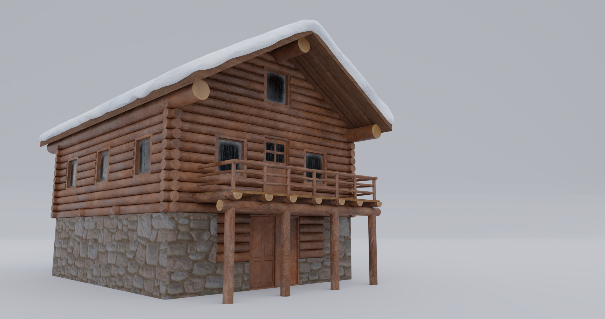
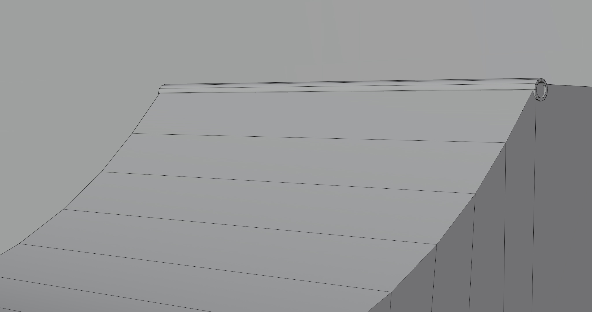

import Spacing from "../components/MDX/Spacing"
import PSpacing from "../components/MDX/PSpacing"
import Grid2 from "../components/MDX/Grid2"
import Grid4 from "../components/MDX/Grid4"
import Summary from "../components/MDX/Summary"
import Item from "../components/MDX/Item"
import PreFooter from "../components/MDX/PreFooter"

import Social from "../components/MDX/Social"
import { FaArtstation } from "@react-icons/all-files/fa/FaArtstation"
import { FaInstagram } from "@react-icons/all-files/fa/FaInstagram"

## Summary

<Grid2>

Winterland is an unreleased fan-made SkaterXL level that I created as a Unity level design and modeling practice project.

In this project, I utilized my knowledge of design to create poster, sticker and logo designs using Figma and Photoshop. Assets were modeled in Blender and textured in Substance 3D Painter. Textures for tree assets were edited in Photoshop, while the tree models were created in SpeedTree for Unity.

</Grid2>

<Social>

<a href="https://www.artstation.com/artwork/wJVe1X" className="social-icon">

<FaArtstation />

View on Artstation

</a>

</Social>

<Social>

<a href="https://www.instagram.com/p/CYRcSQrqx2Z/" className="social-icon">

<FaInstagram />

View on Instagram

</a>

</Social>

<PSpacing>

## Logo design

</PSpacing>

<Item>

</Item>

<PSpacing>

## Stickers

</PSpacing>

<Item>

</Item>

<PSpacing>

## Posters

</PSpacing>

<Grid2>

<Item>

</Item>

<Item>

</Item>

<Item>

</Item>

<Item>

</Item>

</Grid2>

<Spacing />

<Item>

</Item>

<Spacing />

<Item>

</Item>

<PSpacing>

## Buildings and ramps

</PSpacing>

<Grid2>

<Item>

</Item>

<Item>

</Item>

<Item>

</Item>

<Item>

</Item>

<Item>

</Item>

<Item>

</Item>

</Grid2>

<PSpacing>

## Modular pieces

</PSpacing>

<Grid2>

<Item>

</Item>

<Item>

</Item>

<Item>

</Item>

<Item>

</Item>

</Grid2>

<PSpacing>

## Props

</PSpacing>

<Grid2>

<Item>

</Item>

<Item>

</Item>

<Item>

</Item>

<Item>

</Item>

<Item>

</Item>

<Item>

</Item>

<Item>

</Item>

<Item>

</Item>

</Grid2>

<PreFooter />
